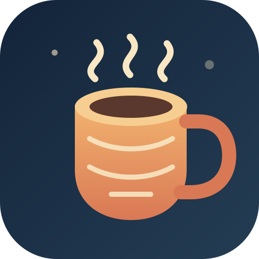
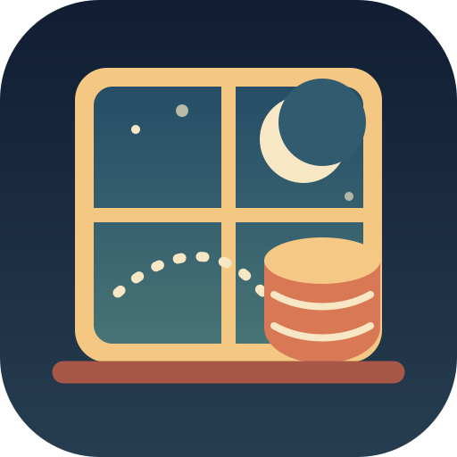

# Repository image options

These original 512 by 512 SVGs are designed to stay readable when reduced to
an avatar. They share a warm navy, cream, amber, and terracotta palette.

| Option | Concept | Best fit |
| --- | --- | --- |
| [`cozy-database-mug.svg`](cozy-database-mug.svg) | A database stack as a warm mug, with an API steam path | Friendly SDK identity |
| [`dab-reading-nook.svg`](dab-reading-nook.svg) | A code book beside a small database lamp | Documentation and developer experience |
| [`knitted-data-stack.svg`](knitted-data-stack.svg) | A database stack wrapped in a scarf | Playful, distinctive small avatar |
| [`moonlit-api-window.svg`](moonlit-api-window.svg) | Data moving through an API window at night | Calm, technical social preview |

The SVG files are source artwork. Export the selected design to PNG at 512 by
512 pixels for services that do not accept SVG uploads.

| | |
| --- | --- |
|  |  |
|  |  |
